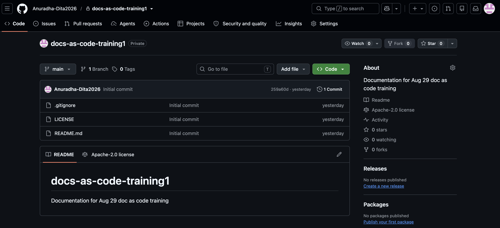

- [Getting Started](#getting-started)
  - [Welcome to our product documentation.](#welcome-to-our-product-documentation)
    - [Before you begin](#before-you-begin)
      - [Next steps](#next-steps)

# Getting Started

Start your paragarph. Start your paragarph. Start your paragarph. Start your paragarph. Start your paragarph.Start your paragarph. Start your paragarph. Start your paragarph.

This is the *second* paragraph. This is the second paragraph. This is the __second paragraph__. This is the second paragraph. This is the second ***paragraph***.

[ ] Setup Columns
[ ]
Here is the change. Modified again..

## Welcome to our product documentation.
 
- This guide explains how to get started with the product.
- This guide is intended for new users.
  - List 1
  - List 2
- This is a new line.

This is a minor change.
 
### Before you begin
 
Make sure you have an active account and access to the application.
 
#### Next steps
 
After completing the prerequisites, continue with the installation guide.
1. Step 1.
   a. On the screen, select **Chat**

   b. Press `Enter`
   c. Press `Return`
   d. Run `Git Clone`
    
``` javascript
function greet(name) {
  return `Hello, ${name}.`;
}
 
console.log(greet("world"));


   ```
   ```javascript
function greet(name) {
  return `Hello, ${name}.`;
}
 
console.log(greet("world"));
   ```
      1. Level 1
      2. level 2
1. Step 2.

```
```
python
def fibonacci(n):
    a, b = 0, 1
    for _ in range(n):
        a, b = b, a + b
    return a

```

3. Step 1.
4. Step 2.
5. Step 3.
Here is the image.

Images



2. Click Save.

| Name | Description | Validation Code |
|:---|...|...|
| Caption | Caption to be provided for the property name | Error |
 
> Note: This is a workshop on markdown.

This is a minor change.

After completing the prerequisites, see the [Installation](installation.md) guide.
Link
[For Details, see ReadMe](/README.md)
[Visit Website](https://www.google.com)

